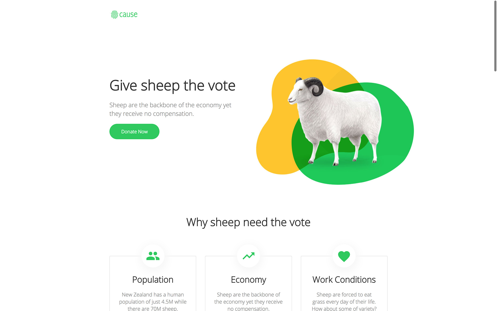

# Cause

Not for profit themed template for Jekyll. Browse through a [live demo](https://clean-oryx.cloudvent.net/).
Increase the web presence of a not for profit or cause website with this configurable theme.

## Setup

1. Add your site details in `_config.yml`.
2. Add your Google Analytics to `_config.yml`.
3. Get a workflow going to see your site's output (with [CloudCannon](https://app.cloudcannon.com/) or Jekyll locally).

## Develop

Cause was built with [Jekyll](http://jekyllrb.com/) version 3.3.1, but should support newer versions as well.

Install the dependencies with [Bundler](http://bundler.io/):

~~~bash
$ bundle install
~~~

Run `jekyll` commands through Bundler to ensure you're using the right versions:

~~~bash
$ bundle exec jekyll serve
~~~

## SEO Tag

This site uses the [jekyll-seo-tag](https://github.com/jekyll/jekyll-seo-tag) plugin. You should at least set a title in front matter on each page. Have a look at the [project page](https://github.com/jekyll/jekyll-seo-tag) for more options.

## Google Analytics

[Google Analytics](https://www.google.com/analytics/) is a third party website analytics tool. To install:
1. Add your Google Analytics key to `_config.yml`
2. Run your site in production `JEKYLL_ENV=production`. This is the default in CloudCannon and GitHub Pages.
